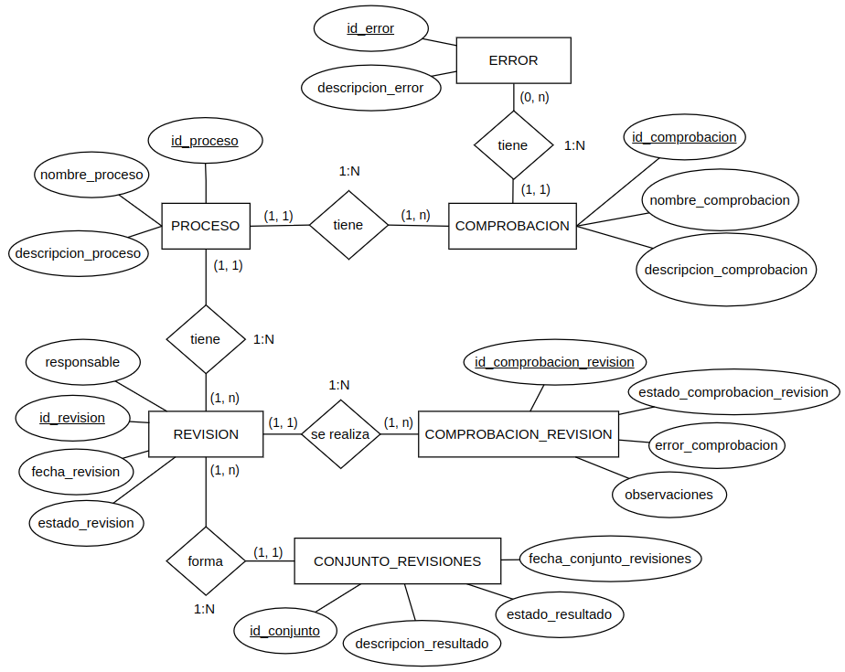

#### Revisión del correcto funcionamiento de los procesos de la línea de producción.

## Descripción detallada

El objetivo de este módulo es la revisión y control de los distintos procesos realizados en la línea de producción para validar su correcto funcionamiento.

Para ello, se han definido una serie de comprobaciones para cada uno de dichos procesos para que, el usuario que acceda al módulo, las valide.

En caso de que alguna de dichas comprobaciones no sean correctas, el usuario deberá indicarlo, abriéndose automáticamente una petición de mantenimiento a rellenar indicando la corrección o reparación a realizar.

En todo caso, el usuario podrá dejar cualquier tipo de comentario en cada una de las comprobaciones para su futura revisión por parte del responsable de producción.

El módulo se ejecutará el primer día laboral de la semana, previo a empezar la producción semanal.

## Mapa del módulo

## Dependencias de otros módulos

* *maintenance*: en el caso de que alguno de los procesos tengan salvedades, se abrirá orden de mantenimiento en dicho módulo.

## Wireframes

## Control de accesos

* Departamento de producción
* Responsable de mantenimiento.

## Diagrama de flujos

## Esquema relacional de nuevas tablas y relación con otras existentes

## Comunicación con otros módulos

* *maintenance*.

